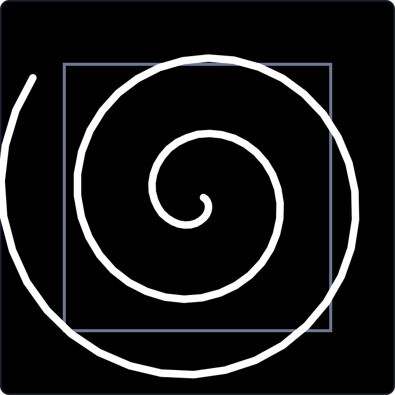

# Spiral — AI co-founder built for agents and loops

<p align="center">
  
</p>

<p align="center">
  <a href="https://github.com/masoudghanbarii/spiral/actions/workflows/ci.yml"></a>
  <a href="https://www.npmjs.com/package/spiral"></a>
  <a href="https://nodejs.org"></a>
  <a href="LICENSE"></a>
</p>

Spiral is an AI co-founder harness that runs autonomous development loops. It implements features from ADRs, tests them, fixes what breaks, and iterates until the goal is met — all inside a terminal-native TUI with multi-session support.

```
╭──────────────────────────────────────────────────────────────────╮
│ spiral v1.0  2 sessions · 1 groups sharing context             │
╰──────────────────────────────────────────────────────────────────╯
╭──────────────╮ ╭──────────────────────────────────────────────╮
│ Sessions     │ │ #1 - auth · running                          │
│              │ │ > implement JWT auth from ADR §2             │
│ ┌──────────┐ │ │ ✦ Implementing JWT middleware...             │
│ │ search…  │ │ │ ⚡ run_tests  ✓ 12 passed, 0 failed          │
│ └──────────┘ │ │ ✦ All tests pass. Goal achieved?             │
│              │ │                                              │
│ #1 auth      │ │ > looks good, ship it                        │
│ ● running    │ │ ✦ Committed. Done! ✅                        │
│              │ │                                              │
│ #2 docs      │ │ 📨 Message from s1: auth implemented, JWT... │
│ ○ connected  │ ╰──────────────────────────────────────────────╯
╰──────────────╯
```

## Install

```bash
npm install -g spiral
```

Requires Node.js 22 or later.

## Quick start

```bash
# Launch the TUI
spiral

# Or start with a specific model
SPIRAL_MODEL=deepseek-v4-flash:cloud spiral

# Or use a different provider
SPIRAL_LLM_PROVIDER=openai SPIRAL_MODEL=gpt-4o spiral
```

The onboarding screen lets you type your first prompt and hit Enter to launch a session.

## How it works

Spiral runs an **agent loop** — the LLM receives your request, calls tools (read/write files, run commands, run tests), and iterates until the task is done.

### Modes

| Mode | Description |
|---|---|
| `normal` | Default — asks approval for destructive tools |
| `loop` | Continuous dev loop — implement, test, fix, repeat until goal met |
| `plan` | Read-only — outputs an implementation plan |
| `bypass` | Skip all permission checks |
| `safe` | Read-only, no command execution |
| `interactive` | User can interject mid-run |

### Multi-session

Spiral's TUI supports multiple concurrent sessions. Each session has its own conversation context, model, and mode. Sessions can:

- **Share info** — use `send_to_session` to pass messages between sessions
- **Link context** — use `link_sessions` to visually group sessions (colored borders, shared group label)
- **Run in parallel** — switch between sessions with `Tab`

### Tools

The agent has access to file operations, git, shell commands, tests, linting, web search, memory, code review, and inter-session communication.

## Configuration

Spiral reads configuration from environment variables, a JSON config file, or defaults.

```bash
# Core
SPIRAL_MODEL=deepseek-v4-flash:cloud    # Model name
SPIRAL_LLM_PROVIDER=ollama              # Provider: ollama|openai|anthropic|deepseek|...
SPIRAL_OLLAMA_BASE_URL=http://localhost:11434

# Behavior
SPIRAL_STREAM=true                      # Enable streaming responses
SPIRAL_AUTO_APPROVE=false               # Auto-approve all tools
SPIRAL_AGENT_MODE=normal                # Default mode

# Limits
SPIRAL_MAX_AGENT_ITERATIONS=50          # Max iterations per agent run
SPIRAL_CONTEXT_WINDOW_TOKENS=32768      # Context window size
```

## Providers

Spiral supports any Ollama-compatible API and OpenAI-compatible APIs:

| Provider | Env var | Default model |
|---|---|---|
| Ollama | `SPIRAL_LLM_PROVIDER=ollama` | `deepseek-v4-flash:cloud` |
| OpenAI | `SPIRAL_LLM_PROVIDER=openai` | `gpt-4o` |
| Anthropic | `SPIRAL_LLM_PROVIDER=anthropic` | `claude-3-5-sonnet` |
| DeepSeek | `SPIRAL_LLM_PROVIDER=deepseek` | `deepseek-chat` |
| OpenRouter | `SPIRAL_LLM_PROVIDER=openrouter` | `auto` |
| Groq | `SPIRAL_LLM_PROVIDER=groq` | `llama-3.3-70b-versatile` |
| Mistral | `SPIRAL_LLM_PROVIDER=mistral` | `mistral-large-latest` |
| xAI | `SPIRAL_LLM_PROVIDER=xai` | `grok-3` |
| Together | `SPIRAL_LLM_PROVIDER=together` | `meta-llama/Llama-3.3-70B-Instruct-Turbo` |

## Keyboard shortcuts

| Key | Action |
|---|---|
| `Enter` | Send message / approve tool |
| `Shift+Enter` or `Ctrl+J` | Insert newline |
| `Ctrl+Backspace` or `Ctrl+W` | Delete last word |
| `Tab` | Switch session (overlay) |
| `Shift+Tab` | Switch mode (overlay) |
| `↑` / `↓` | Navigate overlays / input history |
| `←` / `→` | Navigate models in `/agentplan` |
| `Esc` | Close overlay / abort run |
| `Ctrl+C` | Clear input (press twice to exit) |
| `Ctrl+L` | Clear screen |
| `Ctrl+D` | Exit |

## Slash commands

```
/help              Show help
/mode [mode]       Switch mode: normal|plan|bypass|safe|interactive|loop
/model <model>     Switch LLM model
/new               Start a fresh session
/sessions          List all sessions
/agentplan         Set model per role (plan / build / judge)
/status            Show session status
/usage             Show token usage
/clear             Clear conversation
/reset             Reset session state
/abort             Abort active run
/verbose           Toggle verbose tool output
/tools             List available tools
/history           Show conversation length
/exit              Exit Spiral
```

## Architecture

```
spiral/
├── src/
│   ├── cli.ts              # CLI entry point
│   ├── config.ts           # Configuration from env/file
│   ├── llm.ts              # LLM client wrapper
│   ├── providers.ts        # Provider implementations (Ollama, OpenAI, ...)
│   ├── modes.ts            # Agent mode definitions
│   ├── types.ts            # Shared types
│   ├── loops/
│   │   ├── agent.ts        # Agent loop (ReAct: model → tools → observe)
│   │   ├── verifier.ts     # Verification loop (grade, pass/fail, retry)
│   │   ├── engine.ts       # Engine analysis loop (meta-improvement)
│   │   └── event_driver.ts # Event-driven loop
│   ├── tui/
│   │   ├── app.tsx         # Main TUI (Ink + React)
│   │   ├── commands.ts     # Slash command parsing
│   │   └── components/     # UI components (sidebar, chat, overlays, ...)
│   ├── tools/
│   │   ├── registry.ts     # Tool registry (30+ tools)
│   │   └── session-bridge.ts  # Inter-session communication bridge
│   └── managers/
│       ├── git.ts          # Git operations
│       ├── memory.ts       # Project memory
│       ├── permissions.ts  # Tool permission management
│       ├── project.ts      # Project/file operations
│       ├── sessions.ts     # Session persistence
│       ├── traces.ts       # Execution traces
│       └── state.ts        # Harness state
├── tests/                  # 344 tests (vitest)
└── docs/
    └── assets/             # Logo and images
```

## Development

```bash
git clone https://github.com/masoudghanbarii/spiral.git
cd spiral
npm install
npm run build       # TypeScript compile
npm test            # Run test suite
npm run typecheck   # Type-check without emitting
npm run dev         # Run with tsx (no build needed)
```

## Contributors

<p align="center">
  <a href="https://github.com/masoudghanbarii"></a>
</p>

<p align="center">
  <a href="https://github.com/masoudghanbarii"><strong>Masoud Ghanbari</strong></a> — Creator & Maintainer
</p>

## License

[MIT](LICENSE) © Lanius